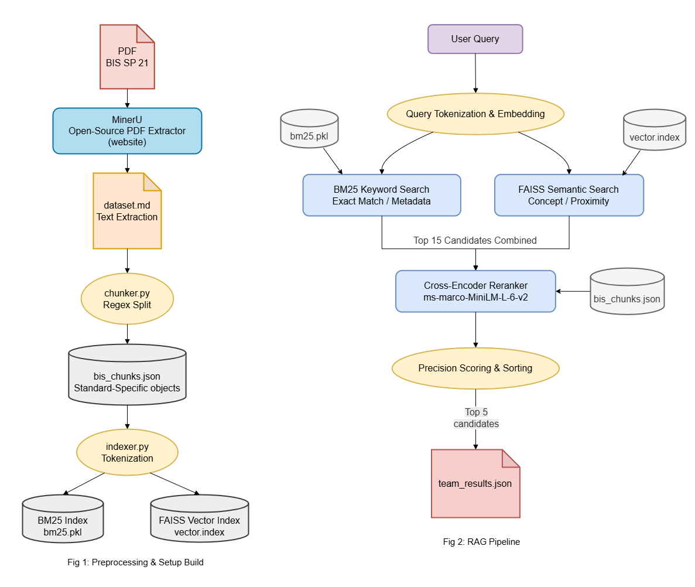

# BIS Standards Recommendation Engine


_Note: used the input data : `public_test_set.json`._

This repository contains my submission for the **BIS Standards Recommendation Engine Hackathon**. I have built an offline-capable, blazing-fast Retrieval-Augmented Generation (RAG) pipeline designed to instantly map product descriptions from Micro and Small Enterprises to the correct Bureau of Indian Standards (BIS) regulations.

---

## System Architecture

To achieve sub-second latency with near-perfect accuracy, I bypassed slow LLM generation for standard extraction and implemented a **Dual-Retrieval + Reranking Architecture**:


1. **Smart Chunking:**
   I utilized custom Regex (with `IGNORECASE`) to intelligently slice the BIS SP 21 document into distinct, highly focused "flashcards."
2. **Dual-Retrieval (Casting a Wide Net, `k=15`):**
    - **Semantic Search:** `FAISS` combined with `all-MiniLM-L6-v2` catches conceptual matches (e.g., "water mains" -> pipes).
    - **Keyword Search:** A custom punctuation-stripped `BM25` implementation ensures exact matches (like specific grades or keywords) are never missed.
3. **Cross-Encoder Reranking (The Precision Judge):**
   The combined pool of 15 candidates is fed into the lightning-fast `ms-marco-MiniLM-L-6-v2` Cross-Encoder. This model scores the query directly against the text of the chunks.
4. **Deterministic Extraction:**
   Instead of asking an LLM to type out the standard (risking typos), our system uses pure Python logic to extract the `standard_id` directly from the metadata of the reranked chunks.

---

## 💻 Hardware & Environment Requirements

This pipeline is highly optimized for offline, local execution. It does not require expensive cloud infrastructure or high-end GPUs to achieve sub-second latency.

-   **Processor (CPU):** Any modern multi-core consumer CPU (Intel i3 / AMD Ryzen 3 or newer).
-   **Graphics (GPU):** Not required. The architecture utilizes `faiss-cpu` and lightweight Hugging Face models.
-   **Memory (RAM):** 4 GB minimum.
-   **Storage:** ~1.2 GB .
-   **OS:** Windows, macOS, or Linux.

---

## 📂 Repository Structure

According to the hackathon guidelines, the repository is structured as follows:

```
├── /data                  # Processed JSON chunks, Vector/BM25 indexes, and dataset files
├── /local_models          # Cached HuggingFace models for 100% offline execution
│   ├── /embedder          # sentence-transformers/all-MiniLM-L6-v2
│   └── /reranker          # cross-encoder/ms-marco-MiniLM-L-6-v2
├── /src                   # Application logic and UI assets
│   ├── /images            # Architecture and pipeline diagrams
│   ├── /templates         # HTML templates for the web interface
│   ├── chunker.py         # Custom regex-based intelligent document chunking
│   └── indexer.py         # FAISS and BM25 index generation script
├── eval_script.py         # Mandatory evaluation script provided by organizers
├── inference.py           # Mandatory entry-point script for judges (CLI)
├── main.py                # Web UI application logic
├── presentation.pdf       # 8-slide presentation deck
├── requirements.txt       # Environment dependencies
└── README.md              # Project documentation
```

---

## 🛠️ Data Ingestion Strategy Disclosure

The provided `dataset.pdf` (BIS SP 21) was challenging to parse algorithmically due to its complex, multi-column tables and OCR irregularities.

To maintain momentum and ensure high-fidelity text extraction without hitting third-party API rate limits, I utilized **MinerU** ([mineru.net](https://mineru.net)), an open-source document understanding tool. I processed the PDF through MinerU to generate the foundational `dataset.md` file.

_Note: As this was a one-time preprocessing step, the RAG pipeline begins its automated execution directly from the `data/dataset.md` file._

---

## 💻 Setup & Execution Guide

1. Install Dependencies

```
pip install -r requirements.txt
```

2. Run the fastapi server

```
uvicorn main:app --reload
```

3. Open the url in the browser

```
http://localhost:8000
```

4. Run Command Line Inference Pipeline

```
python inference.py --input public_test_set.json --output team_results.json
```

5. Evaluate Results

```
python eval_script.py --results team_results.json
```

---

## ▶️ Project Demo video

🎥 Watch the 7-Minute Demo Video [Here](https://drive.google.com/file/d/1Zear87YEAS2A98rJM1C_E7hUW4zeU5CA/view?usp=sharing).
